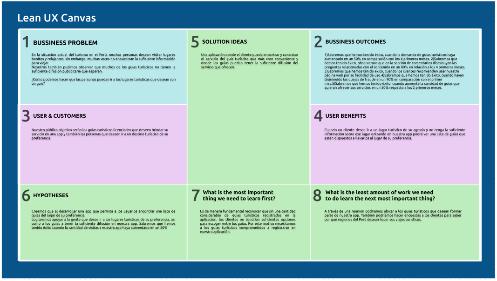

# Universidad Peruana de Ciencias Aplicadas

</img> 

**Curso: Aplicaciones Web** 

**Sección: SI92** 

**Profesor: Naldo Reupo-Musayon Gastulo** 

**Carrera: Ingeniería de Software**

**Ciclo: 2024-02**

**Startup: Motoratones** 

**Producto: Tursitos** 

### Integrantes:

| Nombre       | Código       |
|--------------|--------------|
| ************ | ************ |
| ************ | ************ |
| ************ | ************ |
| ************ | ************ |
| ************ | ************ |

 

# Project Report Collaboration Insights
TB1: Las tareas asignadas para la entrega TB1 se han completado y están documentadas en el siguiente repositorio de Github perteneciente a la organización del equipo:

Durante la preparación del informe, se llevaron a cabo las siguientes actividades:
- Se escribieron y graficaron los contenidos asignados a cada miembro en formato Markdown, seguido de commits para monitorear el progreso de cada integrante en el repositorio.
- Se crearon los artefactos necesarios utilizando las herramientas indicadas en el PDF del proyecto.
- Se organizaron reuniones para asignar las tareas, para coordinar el progreso de los elementos del informe y para comunicar los avances del primer Sprint.

 

# Contenido
## Tabla de contenidos
### [Registro de versiones del informe](#registro-de-versiones-del-informe)
### [Project Report Collaboration Insights](#project-report-collaboration-insights)
### [Student Outcome](#student-outcome)
## [Capítulo I: Introducción](#capítulo-i-introducción)
- [1.1. Startup Profile](#11-startup-profile)
    - [1.1.1. Descripción de la Startup](#111-descripción-de-la-startup)
    - [1.1.2. Perfiles de integrantes del equipo](#112-perfiles-de-integrantes-del-equipo)
- [1.2. Solution Profile](#12-solution-profile)
    - [1.2.1 Antecedentes y problemática](#121-antecedentes-y-problemática)
    - [1.2.2 Lean UX Process](#122-lean-ux-process)
        - [1.2.2.1. Lean UX Problem Statements](#1221-lean-ux-problem-statements)
        - [1.2.2.2. Lean UX Assumptions](#1222-lean-ux-assumptions)
        - [1.2.2.3. Lean UX Hypothesis Statements](#1223-lean-ux-hypothesis-statements)
        - [1.2.2.4. Lean UX Canvas](#1224-lean-ux-canvas)
- [1.3. Segmentos objetivo](#13-segmentos-objetivo)

## [Capítulo II: Requirements Elicitation & Analysis](#capítulo-ii-requirements-elicitation--analysis)
- [2.1. Competidores](#21-competidores)
    - [2.1.1. Análisis competitivo](#211-análisis-competitivo)
    - [2.1.2. Estrategias y tácticas frente a competidores](#212-estrategias-y-tácticas-frente-a-competidores)
- [2.2. Entrevistas](#22-entrevistas)
    - [2.2.1. Diseño de entrevistas](#221-diseño-de-entrevistas)
    - [2.2.2. Registro de entrevistas](#222-registro-de-entrevistas)
    - [2.2.3. Análisis de entrevistas](#223-análisis-de-entrevistas)
- [2.3. Needfinding](#23-needfinding)
    - [2.3.1. User Personas](#231-user-personas)
    - [2.3.2. User Task Matrix](#232-user-task-matrix)
    - [2.3.3. User Journey Mapping](#233-user-journey-mapping)
    - [2.3.4. Empathy Mapping](#234-empathy-mapping)
    - [2.3.5. As-is Scenario Mapping](#235-as-is-scenario-mapping)
- [2.4. Ubiquitous Language](#24-ubiquitous-language)

## [Capítulo III: Requirements Specification](#capítulo-iii-requirements-specification)
- [3.1. To-Be Scenario Mapping](#31-to-be-scenario-mapping)
- [3.2. User Stories](#32-user-stories)
- [3.3. Impact Mapping](#33-impact-mapping)
- [3.4. Product Backlog](#34-product-backlog)

## [Capítulo IV: Product Design](#capítulo-iv-product-design)
- [4.1. Style Guidelines](#41-style-guidelines)
    - [4.1.1. General Style Guidelines](#411-general-style-guidelines)
    - [4.1.2. Web Style Guidelines](#412-web-style-guidelines)
- [4.2. Information Architecture](#42-information-architecture)
    - [4.2.1. Organization Systems](#421-organization-systems)
    - [4.2.2. Labeling Systems](#422-labeling-systems)
    - [4.2.3. SEO Tags and Meta Tags](#423-seo-tags-and-meta-tags)
    - [4.2.4. Searching Systems](#424-searching-systems)
    - [4.2.5. Navigation Systems](#425-navigation-systems)
- [4.3. Landing Page UI Design](#43-landing-page-ui-design)
    - [4.3.1. Landing Page Wireframe](#431-landing-page-wireframe)
    - [4.3.2. Landing Page Mock-up](#432-landing-page-mock-up)
- [4.4. Web Applications UX/UI Design](#44-web-applications-uxui-design)
    - [4.4.1. Web Applications Wireframes](#441-web-applications-wireframes)
    - [4.4.2. Web Applications Wireflow Diagrams](#442-web-applications-wireflow-diagrams)
    - [4.4.3. Web Applications Mock-ups](#443-web-applications-mock-ups)
    - [4.4.4. Web Applications User Flow Diagrams](#444-web-applications-user-flow-diagrams)
- [4.5. Web Applications Prototyping](#45-web-applications-prototyping)
- [4.6. Domain-Driven Software Architecture](#46-domain-driven-software-architecture)
    - [4.6.1. Software Architecture Context Diagram](#461-software-architecture-context-diagram)
    - [4.6.2. Software Architecture Container Diagrams](#462-software-architecture-container-diagrams)
    - [4.6.3. Software Architecture Components Diagrams](#463-software-architecture-components-diagrams)
- [4.7. Software Object-Oriented Design](#47-software-object-oriented-design)
    - [4.7.1. Class Diagrams](#471-class-diagrams)
    - [4.7.2. Class Dictionary](#472-class-dictionary)
- [4.8. Database Design](#48-database-design)
    - [4.8.1. Database Diagram](#481-database-diagram)

## [Capítulo V: Product Implementation, Validation & Deployment](#capítulo-v-product-implementation-validation--deployment)
- [5.1. Software Configuration Management](#51-software-configuration-management)
    - [5.1.1. Software Development Environment Configuration](#511-software-development-environment-configuration)
    - [5.1.2. Source Code Management](#512-source-code-management)
    - [5.1.3. Source Code Style Guide & Conventions](#513-source-code-style-guide--conventions)
    - [5.1.4. Software Deployment Configuration](#514-software-deployment-configuration)
- [5.2. Landing Page, Services & Applications Implementation](#52-landing-page-services--applications-implementation)
    - [5.2.1. Sprint 1](#521-sprint-1)
        - [5.2.1.1. Sprint Planning 1](#5211-sprint-planning-1)
        - [5.2.1.2. Sprint Backlog 1](#5212-sprint-backlog-1)
        - [5.2.1.3. Development Evidence for Sprint Review](#5213-development-evidence-for-sprint-review)
        - [5.2.1.4. Testing Suite Evidence for Sprint Review](#5214-testing-suite-evidence-for-sprint-review)
        - [5.2.1.5. Execution Evidence for Sprint Review](#5215-execution-evidence-for-sprint-review)
        - [5.2.1.6. Services Documentation Evidence for Sprint Review](#5216-services-documentation-evidence-for-sprint-review)
        - [5.2.1.7. Software Deployment Evidence for Sprint Review](#5217-software-deployment-evidence-for-sprint-review)
        - [5.2.1.8. Team Collaboration Insights during Sprint](#5218-team-collaboration-insights-during-sprint)

- [5.3. Validation Interviews](#53-validation-interviews)
    - [5.3.1. Diseño de entrevistas](#531-diseño-de-entrevistas)
    - [5.3.2. Registro de entrevistas](#532-registro-de-entrevistas)
    - [5.3.3. Evaluación según heurísticas](#532-evaluación-según-heurísticas)

- [5.4. Video about the product](#54-video-about-the-product)

# Capítulo I: Introducción
## 1.1. Startup Profile
### 1.1.1. Descripción de la Startup
** Descripción de la empresa:** 
Motoratones es una Startup que busca facilitar el acceso a la rica cultura e historia de los lugares más impresionantes del mundo. En países como Perú, conocido por sus antiguas construcciones, exuberantes selvas y majestuosas montañas, es común olvidar que detrás de cada sitio histórico se esconden numerosas historias y curiosidades. Aunque los guías turísticos son quienes pueden compartir estos relatos, contactarlos de manera segura puede ser un reto debido a posibles fraudes. Nuestra propuesta es una solución tecnológica que conectará de forma directa y confiable a los turistas con guías turísticos, abordando esta problemática en el sector del turismo.

** Visión:** 
Nuestra visión es convertirnos en líderes en la promoción del turismo vivencial en las áreas más remotas de los pueblos andinos, brindando a los viajeros aventureros un acceso seguro y sencillo a experiencias auténticas e inolvidables. Buscamos crear un vínculo entre las comunidades locales y los visitantes, fomentando el respeto por la cultura y el entorno natural, al tiempo que contribuimos al desarrollo sostenible de las regiones en las que operamos.

** Misión:** 
Nuestra misión es crear conexiones significativas entre los viajeros y las culturas locales, fomentando experiencias turísticas auténticas que enriquezcan la vida de nuestros usuarios y beneficien a las comunidades anfitrionas. Nos dedicamos a brindar un servicio excepcional, impulsado por la innovación y la pasión por el turismo responsable.

** Descripción del producto:** 
Tursitos es nuestra innovadora plataforma digital diseñada para conectar a viajeros aventureros con guías locales y proveedores de servicios turísticos en las áreas más remotas de los pueblos andinos. Centrada en el turismo vivencial, responde a la creciente demanda de experiencias auténticas y significativas en entornos naturales únicos. La plataforma ofrece una solución completa para quienes buscan explorar destinos fuera de lo común, facilitando la comunicación a través de mapas interactivos que muestran rutas, puntos de interés, horarios de salida y llegada, así como perfiles detallados de los guías, que incluyen su formación, licencias y datos personales, además de opiniones de usuarios anteriores sobre sus servicios.

### 1.1.2 Perfiles de integrantes del equipo 
| Nombre       | Código       | Descripcion  |Imagen        |
|--------------|--------------|--------------|--------------|
| ************ | ************ | ************ | ************ |
|Alexande Paolo Justo Yauricasa|U20191C054| Soy estudiante de Ingeniería de Software en la UPC. Me considero alguien responsable y altamente motivado para completar todos mis trabajos académicos. Me comprometo a cumplir con mis tareas y a alentar a mis compañeros de equipo para alcanzar los objetivos del curso. | |
| Carlos Alejandro De La Cruz Villarreal | u20211c036 | Soy un estudiante la carrera de Ingeniería de Software en la UPC; considero que soy una persona responsable y con una fuerte motivación para culminar todos mis trabajos universitarios. Me comprometo a cumplir y motivar a mis compañeros de grupo para poder lograr el objetivo del curso. |  |
|Jose Raul Chirito Torres|U20201A203|--------------|--------------|
|--------------|--------------|--------------|--------------|
|--------------|--------------|--------------|--------------|
|--------------|--------------|--------------|--------------|
| ************ | ************ | ************ | ************ |
## 1.2 Solution Profile 
### 1.2.1 Antecedentes y Problemática
En esta parte utilizamos el 5w 2h para conocer los puntos importantes del problema al cual nos enfrentamos:

Who (Quién): La plataforma está dirigida a viajeros aventureros y amantes de la naturaleza que buscan experiencias auténticas. Los clientes potenciales son guías locales y proveedores de servicios turísticos en áreas remotas de los pueblos andinos.

What (Qué): El proyecto consiste en desarrollar una plataforma digital que conecte a los usuarios con guías locales y proveedores de servicios turísticos en áreas remotas. Esta plataforma facilitará la reserva de experiencias auténticas y memorables en entornos naturales únicos.

Where (Dónde): Inicialmente, la plataforma se enfocará en áreas remotas de pueblos lejanos, con la posibilidad de expandirse en el futuro a otras regiones similares.

When (Cuando): La problemática es actual, ya que el turismo en Perú no está completamente gestionado. El desarrollo y lanzamiento de la plataforma se llevará a cabo en un periodo determinado.

Why (Por qué): El proyecto busca resolver la falta de acceso a experiencias turísticas auténticas en áreas remotas y satisfacer la creciente demanda de turismo vivencial entre los viajeros aventureros y amantes de la naturaleza.

How (Cómo): La plataforma se desarrollará como una aplicación web que facilitará la conexión entre usuarios, guías locales y proveedores de servicios turísticos en áreas remotas, permitiendo la reserva de experiencias y la comunicación durante el viaje.

How much (Cuánto): Los costos variarán según factores como el desarrollo de la aplicación, los gastos de marketing y las tarifas de membresía para los proveedores de servicios turísticos.

### 1.2.2 Lean UX Process
#### 1.2.2.1 Lean UX Problem Statement
Nuestra aplicación tiene como objetivo proporcionar a los guías turísticos una alternativa para conectarse con los turistas, facilitando la planificación de sus viajes de turismo vivencial. A su vez, nos comprometemos a promocionar a los guías, asegurando que tanto ellos como los turistas se sientan seguros y confiados al utilizar la plataforma.

Identificamos ciertos desafíos que podrían afectar nuestra app, como la dificultad que enfrentan los turistas para experimentar la autenticidad y belleza de los pueblos andinos. Para los guías locales, esto se traduce en una falta de oportunidades para promocionar sus servicios y compartir su conocimiento especializado.

Para solucionar este problema, nuestra visión es desarrollar una plataforma digital que conecte a los viajeros aventureros con guías locales especializados en los pueblos andinos, ofreciendo acceso seguro y sencillo a experiencias turísticas auténticas y memorables. Nos hacemos preguntas clave como: ¿cómo podemos aumentar la confianza de nuestros clientes en nuestra plataforma? y ¿cuál es la importancia de una plataforma centrada en el turismo vivencial?

#### 1.2.2.2 Lean UX Assumptions
** Business outcomes** 

Nuestra iniciativa en el ámbito del turismo vivencial busca satisfacer la creciente demanda de experiencias auténticas y en contacto directo con la naturaleza en áreas remotas y de difícil acceso. Planeamos generar ingresos ofreciendo paquetes turísticos personalizados que incluyan actividades exclusivas y significativas en entornos naturales únicos.

** User benefits** 

Nuestra plataforma brindará a los usuarios la oportunidad de sumergirse en la cultura local y en la belleza natural de lugares remotos a través de experiencias auténticas de turismo vivencial. Los usuarios podrán participar en actividades interactivas y enriquecedoras, como caminatas guiadas por expertos locales, talleres de artesanía tradicional y encuentros con comunidades indígenas.

** User & Costumers** 

Nuestros usuarios principales serán viajeros aventureros y amantes de la naturaleza en busca de experiencias únicas y significativas durante sus viajes. Nuestros clientes serán guías locales y proveedores de servicios turísticos en áreas remotas, quienes se beneficiarán de alcanzar una audiencia más amplia y diversa a través de nuestra plataforma.

1. ¿Quién(es) es el Usuario?

Los usuarios de nuestra plataforma son personas que valoran las experiencias auténticas y desean explorar destinos fuera de lo común en contacto directo con la naturaleza y la cultura local.

2. ¿Dónde Encaja Nuestro Producto en su Trabajo o Vida?

Nuestro producto se integra en la planificación y ejecución de viajes de turismo vivencial, ofreciendo a los usuarios acceso a una variedad de experiencias y actividades en entornos naturales remotos.

3. ¿Qué Problemas tiene nuestro producto? ¿Qué Resuelve?

Uno de los desafíos clave es garantizar la calidad y seguridad de las experiencias ofrecidas por los guías turísticos en nuestra plataforma. Además de facilitar la interacción con ellos mediante una interfaz web.

4. ¿Cuándo y Cómo se usa nuestro Producto?

Nuestro producto se utiliza durante la fase de planificación y reserva del viaje. En otras palabras, desde que el cliente turista quiere planificar su viaje y quiere adquirir el equipamiento, así como los conocimientos e información pertinente para su estadía.

5. ¿Qué características son importantes?

Es crucial que nuestro producto ofrezca información detallada sobre las experiencias ofrecidas, incluyendo ubicación, itinerario y requisitos previos. También es importante facilitar la comunicación entre los usuarios y los proveedores de servicios turísticos locales.

6. ¿Cómo Debe Verse Nuestro Producto y Cómo Debe Comportarse?

Nuestro producto debe tener una interfaz intuitiva y atractiva que refleje la naturaleza aventurera y emocionante del turismo vivencial. Debe ser fácil de navegar y permitir a los usuarios encontrar y reservar experiencias de manera rápida y sencilla.

¿Qué Ofrece Nuestro Producto?

1. Creemos que Nuestros Clientes Necesitan:

Una plataforma que les brinde acceso a experiencias auténticas de turismo vivencial en áreas remotas y de difícil acceso.

2. Estas Necesidades se Pueden Resolver con:

Una aplicación móvil que conecte a los usuarios con guías locales y proveedores de servicios turísticos en áreas remotas, facilitando la reserva de experiencias y la comunicación durante el viaje.

3. Nuestros Clientes Son o Serán:

Viajeros aventureros y amantes de la naturaleza que buscan experiencias únicas y significativas en destinos fuera de lo común.

4. El Valor Principal que un Cliente Quiere de Nuestro Servicio es:

Acceso a experiencias auténticas y significativas en entornos naturales remotos.

5. El Cliente También Puede Obtener Estos Beneficios Adicionales:

Interacción con guías locales y comunidades indígenas.
Seguridad y confianza en la calidad de las experiencias ofrecidas.
Apoyo en la planificación y ejecución de viajes a áreas de difícil acceso.
6. Adquiriremos la Mayoría de Nuestros Clientes a través de:

Una estrategia de marketing digital centrada en destacar la autenticidad y exclusividad de nuestras experiencias de turismo vivencial, dirigida a viajeros aventureros y amantes de la naturaleza.

7. Generaremos Ingresos a través de:

Comisiones por reservas realizadas a través de nuestra plataforma y tarifas de membresía para proveedores de servicios turísticos locales.

8. Nuestra Competencia Principal en el Mercado Será:

Otras plataformas de reserva de experiencias turísticas y operadores turísticos tradicionales que ofrecen viajes a destinos convencionales.

9. Los Venceremos Debido a:

Nuestra especialización en turismo vivencial y nuestra amplia red de guías locales y proveedores de servicios turísticos en áreas remotas.

10. Nuestro Mayor Riesgo de Producto es...

La falta de disponibilidad de servicios básicos en áreas de difícil acceso, como alojamiento y transporte.

11. Resolveremos esto a través de…

Asociaciones estratégicas con proveedores de servicios turísticos locales y el desarrollo de soluciones innovadoras para abordar estas necesidades específicas.

#### 1.2.2.3. Lean UX Hypothesis Statements

Usuario cliente:

Comentarios de los usuarios:
Creemos que al implementar una función donde las personas puedan dejar y leer opiniones sobre los guías turísticos contactados a través de nuestra página web, lograremos que los clientes se mantengan activos y bien informados sobre la actitud y comportamiento de los guías que contratan. Sabremos que hemos tenido éxito cuando la demanda de guías turísticos aumente en un 50% en comparación con los primeros cuatro meses.

Detalle en el recorrido:
Creemos que al incluir un mapa interactivo que muestre los lugares clave del recorrido ofrecido por el guía, junto con los horarios específicos para cada parada, los clientes podrán conocer el itinerario sin necesidad de hacer preguntas adicionales. Sabremos que hemos tenido éxito cuando las preguntas relacionadas con el contenido del recorrido disminuyan en un 80% en los comentarios, en comparación con los primeros cuatro meses.

Búsqueda de recorridos:
Creemos que al crear una página intuitiva que permita buscar recorridos por guía turístico, lugar o zona, y ordenar los resultados por recomendación, precio o tiempo, los clientes podrán encontrar fácilmente el recorrido que mejor se adapte a sus necesidades. Sabremos que hemos tenido éxito cuando los clientes recomienden nuestra página por su facilidad de uso.

Usuario guía:

Confirmar la licencia de guía:
Creemos que al permitir que solo guías con licencia promocionen sus servicios en nuestra página, lograremos que los turistas confíen más en nuestra plataforma. Sabremos que hemos tenido éxito cuando las quejas de fraude disminuyan en un 90% respecto al primer mes.

Creación de perfil:
Creemos que al ofrecer una página intuitiva que permita a los guías crear un perfil donde puedan describirse, detallar su recorrido y añadir información sobre servicios adicionales, lograremos atraer a más guías por la facilidad de promocionarse. Sabremos que hemos tenido éxito cuando el número de guías que ofrezcan sus servicios aumente en un 50% en comparación con los primeros dos meses.

#### 1.2.2.4. Lean UX Canvas

Ver a detalle en el anexo 1

## 1.3 Segmentos Objetivo
Segmento Objetivo #1: **Viajeros (18+ años)**
Este segmento abarca a personas de 18 años o más que buscan guías especializados para explorar zonas turísticas en Perú, ya sea en la costa, sierra o selva. Independientemente de su edad, estos viajeros buscan experiencias auténticas y un acompañamiento experto para conocer mejor los destinos que visitan.

Segmento Objetivo #2: **Guías turísticos experimentados (18+ años)**
Este segmento está compuesto por guías turísticos experimentados, mayores de 18 años, que necesitan una herramienta efectiva para conectarse con más clientes. Buscan una plataforma que funcione como intermediario, facilitando la promoción de sus servicios en las zonas turísticas donde operan.

## [Conclusiones](#conclusiones)
- [Conclusiones y Recomendaciones](#conclusiones-y-recomendaciones)
- [Video about the team](#video-about-the-team)

## [Bibliografía](#bibliografía)
## [Anexos](#anexos)
Anexo 1: Link del Lean Ux Canvas: 
https://www.figma.com/design/k4KqWTBoMiBt56x1bP2Nys/Untitled?node-id=0-3&t=tOGrjWOTQ5eWb0Ko-1   

# Capítulo II : Requirements Elicitation & Analysis 	

## 2.1 Competidores
Nuestros competidores son empresas dentro del sector turístico, específicamente aquellas que se dedican a conectar a los turistas con guías turísticos.

A continuación, mencionaremos algunos de los competidores de nuestro rubro:
**Get Your Guide: https://www.getyourguide.es/**

**Tours By Locals: https://www.toursbylocals.com/**

## [Conclusiones](#conclusiones)
- [Conclusiones y Recomendaciones](#conclusiones-y-recomendaciones)
- [Video about the team](#video-about-the-team)

## [Bibliografía](#bibliografía)
## [Anexos](#anexos)
